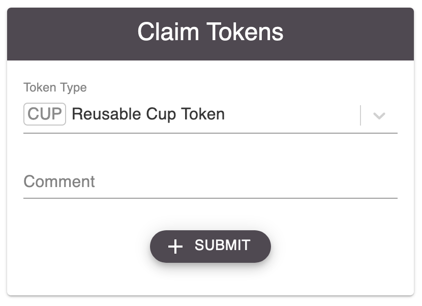
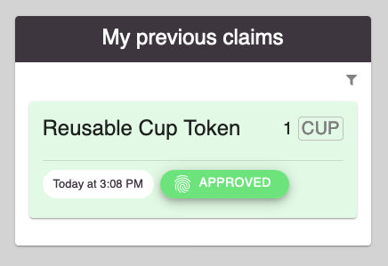
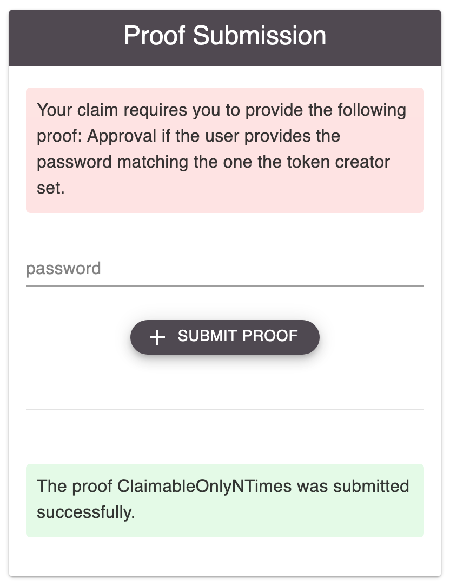
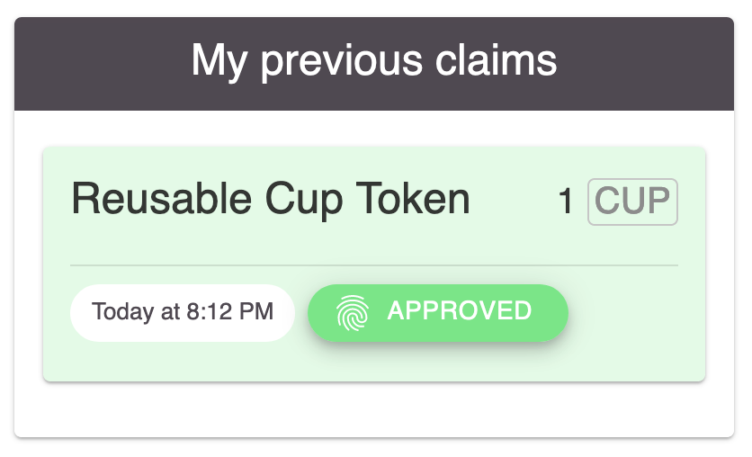

Claim tokens
=============

|

|

Tokens that have been created as outlined in `Create tokens <create-tokens.html>`_, can be claimed.

Submitting a claim is the first step to obtaining a balance on the token in question. Once made, it shows up under *My previous claims*. Claims there can be in one of three stages:

- In red with a prompt to *Submit proof*, this is the default after submitting a new claim
- In green, the approved state, which also means that a balance has to be minted to the claimer
- In gray, the rejected state, if one or more of the proofs got manually or automatically rejected

A click on the filter-icon in the top right corner will open a menu that allows you to hide or show claims based on their three stages. 

Proving
^^^^^^^

For a claim to be successful, all the verifiers specified by the token creator have to receive proof from the user and get approved - automatically or by the chosen person, group or sensor. A proof submission site might look like this.

Here, a verifier is shown (*ClaimableOnlyNTimes*) that didn't have to be initated manually. It belongs to the category of verifiers that automatically give their approval or rejection once a claim is made.

Once all verifiers received proofs and are approved, the claim appears as green and the claimer gets a balance on this token.

.. image:: images/Wallet.png
   :scale: 35%

If any verifier of a claim rejectes the provided proof, the entire claim gets rejected. It is not possible to recover this claim by resubmitting proofs - a new claim has to be made if the user wants to try again.

If verifiers depend on the approval of other users, they have a chance to add a message to the claimer together with their approval or rejection. This message is displayed on the respective proof submission site.
