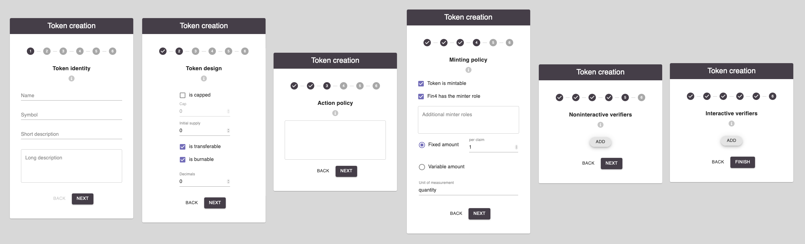

.. comment include:: utils.rst

Create tokens
=============

|

|

The ability for anyone to create new tokens on the FIN4Xplorer plattform is at the heart of its concept. Once a token is created, it can be claimed by anyone. A successful claim results in having a balance on the respective token. Since we base our token contracts on the `ERC20 standard <https://en.wikipedia.org/wiki/Ethereum#Development_governance_and_EIP>`_ this balance will show up on any Ethereum digital wallet app that supports the ERC20 standard. Note that also there you would have to switch to the Rinkeby testnet for now.

The effort put into creating a token can range from a quick 1-min-clicktrough to a lengthy eloborate planning in a multi-disciplinary team. It starts by:

- Creating a new token from scratch
- Uploading a token draft in JSON format
- Copying an existing token design as template

The last two will import a token creation draft showing up at the bottom of the box. The first option will take you directly into the token creation wizard. It consists of 5 steps concerning the way you want to construct token: Identity, Design, Actions, Minting and Proving. In each step, an info box can be opened that provides explanation to the options in each step.

Note that at any point you can leave the wizard and your progess will be stored as draft that you could download, and reimport later, as JSON.

Once you completed the 5 steps and are ready to create your new token on the blockchain, you will have to confirm one ore more transactions. One more for each proof you chose that had parameters to set. Until you confirmed all proof-parameterization transactions, your token will be in a disabled state.
