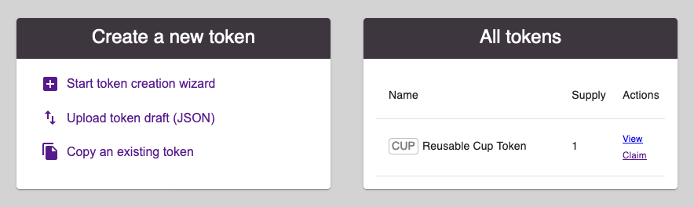
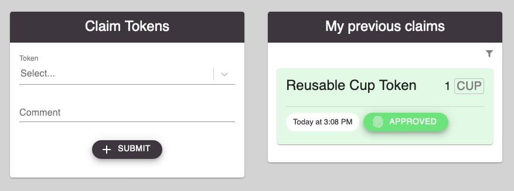

Application overview
====================

Home
~~~~

*Home* acts as landing page and is the central place of the DApp.

The two main subsites are accessible in the bottom bar: `Tokens`_ and `Claims`_.

The three icons in the top bar are for showing the users QR code, reloading the page and for getting notified about new messages.

The various boxes shown are explained in the chapter `More functionalities <more-functionalities.html>`_.

Tokens
~~~~~~

Under *Tokens* new tokens can be created as described in `Create tokens <create-tokens.html>`_. On the right side all existing tokens are listed with direct links to claiming them or to view more details about them.

Clicking on *View* on a Token brings up a dedicated site showing details about the design and some performance statistics of the token.

Claims
~~~~~~

The layout of the *Claims* site is analog to the *Tokens* site: submitting new claims can be done on the left side and a list of previous claims is displayed on the right side. If users get to this site via a *Claim*-Link on a token directly, the *Token Type* will be prefilled. More info about the claiming process can be found in `Claim tokens <claim-tokens.html>`_.

