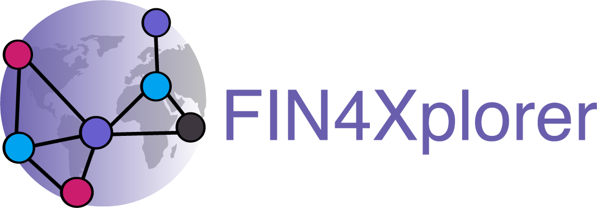

FIN4Xplorer documentation
=========================

Welcome to the documentation of the FIN4Xplorer plattform.

The latest live version can be found at `demo.finfour.net <https://demo.finfour.net/>`_ and more general information are available at `finfour.net <http://finfour.net/>`_.

The basic idea is: anyone can create tokens and anyone can claim these tokens. Once a claim is made, the user has to provide proof that the associated positive action actually happened. Which proof or proofs these are, is decided by the token creator when designing the token. If all proofs on a claim are automatically (e.g. a location to be within a certain circle) or manually (e.g. someone involved in the action is asked to approve a photo) approved, the claimer gets an amount "minted" on that token. We say someone "gets tokens", which basically means that that persons public address gets an entry in the balance-sheet on the respective token with a positive number.

.. toctree::
   :maxdepth: 2
   
   getting-started.rst
   dapp-overview.rst
   create-tokens.rst
   claim-tokens.rst
   more-functionalities.rst

The `FIN4Documentation repository <https://github.com/FuturICT2/FIN4Documentation/blob/main/LICENSE>`_ that this documentation is being build from is licensed under "Creative Commons Attribution Share Alike 4.0 International" (CC-BY-SA-4.0). Both the `FIN4Xplorer repository <https://github.com/FuturICT2/FIN4Xplorer/blob/main/LICENSE>`_ as well as the `FIN4Contracts repository <https://github.com/FuturICT2/FIN4Contracts/blob/main/LICENSE>`_ are licensed under "GNU Affero General Public License v3.0" (AGPL-3.0).