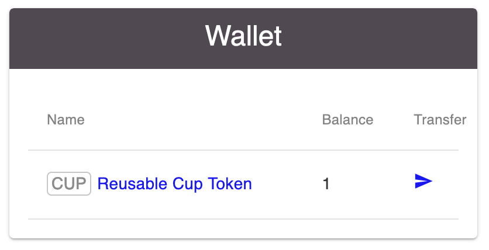
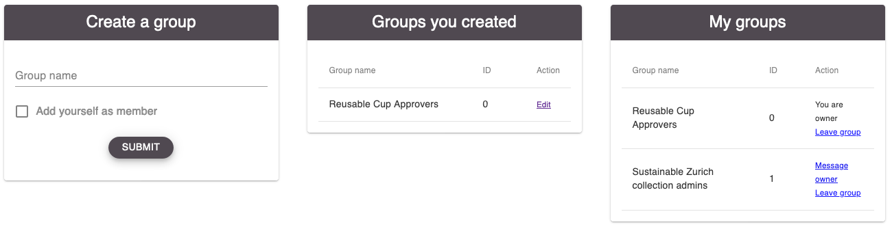
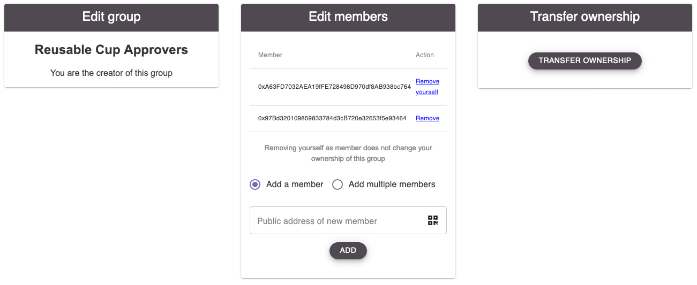
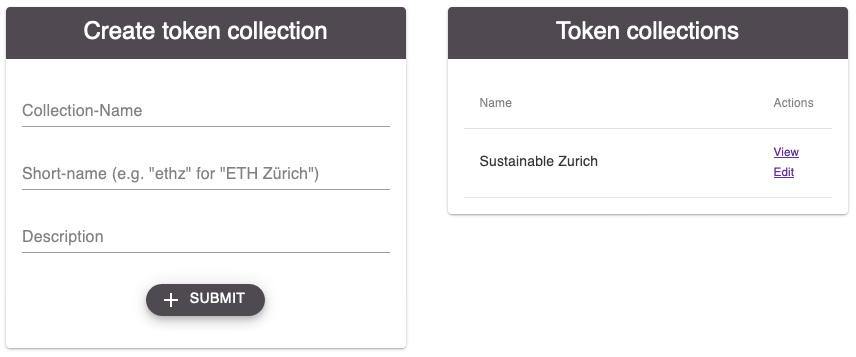
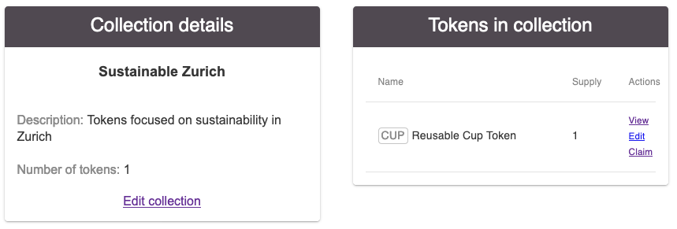
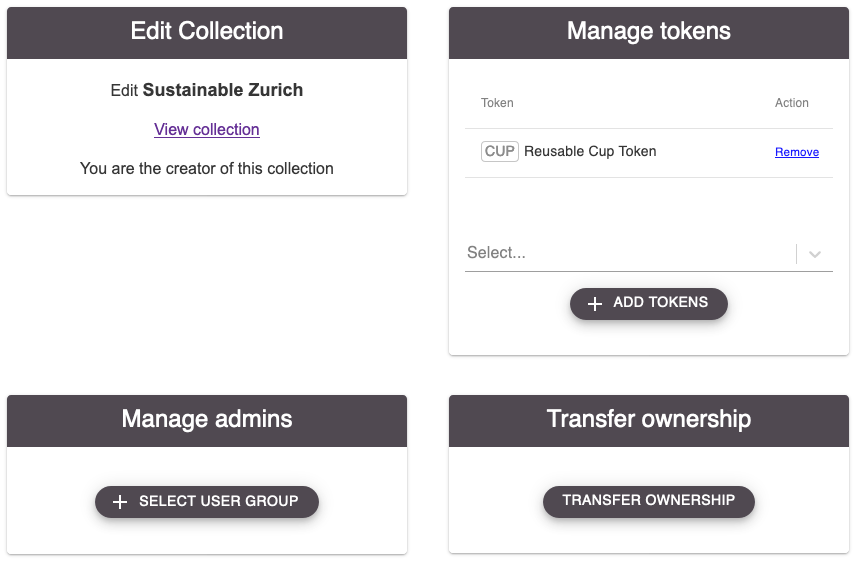

More functionalities
====================

All the functionalities presented below are accessible via the `Home site <dapp-overview.html#home>`_.

Wallet
~~~~~~

The wallet box shows the users balance on all tokens with approved claims. The token name links to its respective detailed site (TODO ref).

The transfer icon links to a site allowing the `transfer <#transfer-tokens>`_ of balances on transferable tokens to other users.

Transfer Tokens
^^^^^^^^^^^^^^^
Note that once a transfer has been made, there is no way to undo it from the senders site. Only the recipient could choose to send it back.

.. image:: images/Transfer.png
   :scale: 80%

Settings
~~~~~~~~

*Settings* contains Links to the *About* and *System settings* sites. The latter contains the language preference and a list of relevant smart contract addresses.

.. image:: images/Settings.png
   :scale: 80%

Furthermore, `User groups <#id1>`_ and `Token collections <#id2>`_ can be found there.

User Groups
^^^^^^^^^^^

User groups can be used for two purposes. Firstly to define "administrators" of a `token collection <#id2>`_ who can add or remove tokens from a collection. Secondly, certain proof types can notify members of a user group about a pending approval that one of them should approve or reject.

Under *My groups* users can message the owner (unless they are the owner) and leave groups (also possible for owners). Upon leaving a group, users can choose to notify the group owner about it or not.

Editing a group as owner comprises the options to add or remove members and to transfer ownership of the group.

Token collections
^^^^^^^^^^^^^^^^^

Token collections are a way to curate a list of tokens with a much lower effort then the `token curated registry <#token-curation>`_.

They can be used for organisations to promote their tokens in one place, for individuals to create portfolios or other use cases.

The collection creator can add or remove tokens from the collection, appoint an admin group to do the same or transfer ownership of the collection.

Inbox
~~~~~

.. image:: images/Inbox.png
   :scale: 80%
   :align: right

*Your messages* shows all messages sent to you. These can be

- Proof contracts notifying you about pending approvals: for you directly or a group you are a member of
- Reasons why a proof you submitted got rejected
- System notifications like a user leaving a group you created
- Messages from other users

If you get a new message while being on the DApp, the notification bell in the top right corner of the site will turn yellow and take you to the messages site upon clicking.

*Message user* takes you to the option to message other users directly. The QR icon can be used to scan the public address of the recipient instead of having to type or paste it in.

Token curation
~~~~~~~~~~~~~~

.. image:: images/TokenCuration.png
   :scale: 80%

Listing
^^^^^^^

.. image:: images/Listing.png
   :scale: 30%

Management
^^^^^^^^^^

Parameters
^^^^^^^^^^

